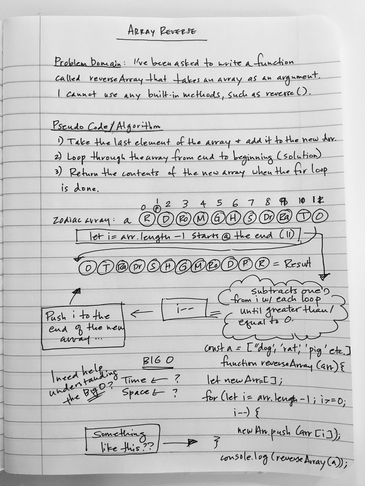

# Reverse an Array
Write a function called reverseArray which takes an array as an argument. Without utilizing any of the built-in methods available to the language, return an array with elements in reversed order.

## Challenge
Think of how to reverse an array without using the built-in method reverse(). I will need to declare a variable array with elements and write a function that loops through and outputs a reverse order.

## Approach & Efficiency
I declared a new variable called newArr and did a for loop on the length of the argument array minus 1, to start at the end of the length. I used i-- to subtract each index w/ each loop until it was greater than/equal to 0, then pushed the index to the new array. The output returns a reverse order on an argument of an array. I think the code is straight forward and efficient while abiding by the rule of not using any built-in methods.

## Solution
