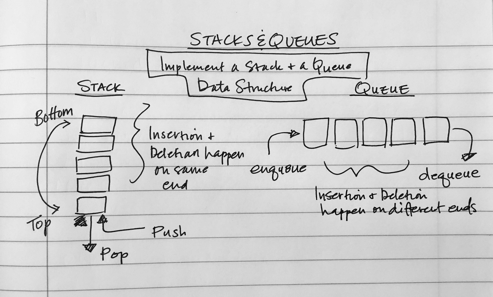

# Implements a Queue using two Stacks
Write a function with classes and methods that allows you to implement a Queue using two Stacks. 

## Challenge
Create a new PseudoQueue class that implements the standard queue interface using two methods. It will internally utilize two stacks.

## Approach & Efficiency

## Solution
