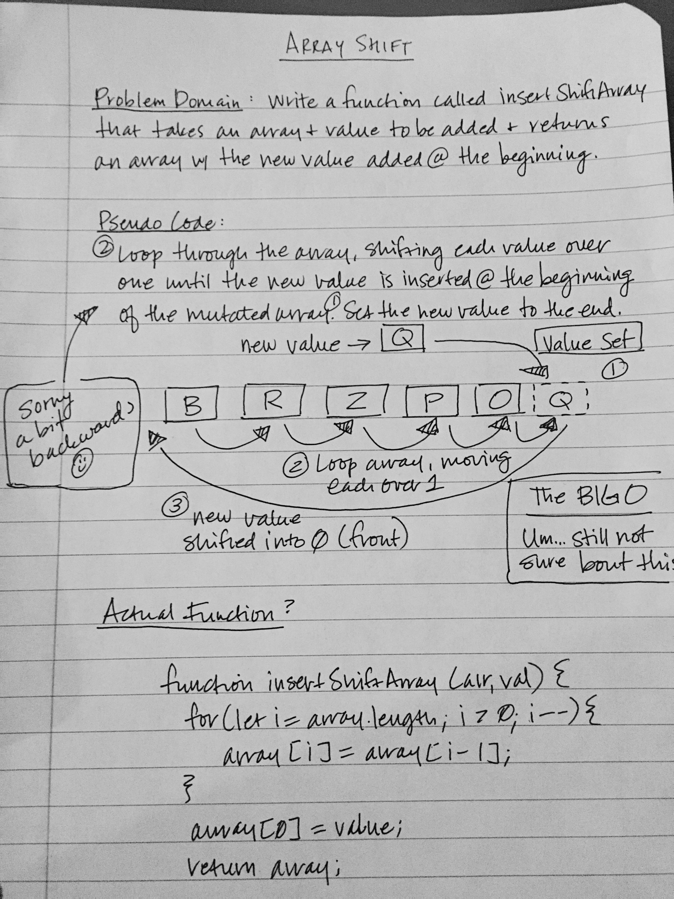

# Implement a Stack and a Queue Data Structure
A function called insertShiftArray which takes in an array and a value to be added and returns an array with the new value added at the beginning index.

## Challenge
Write a function called insertShiftArray which takes in an array and the value to be added. Without utilizing any of the built-in methods available to your language, return an array with the new value added at the beginning index.

## Approach & Efficiency
I did a for loop on the length of the argument array using i-- to subtract each index w/ each loop that was greater than 0, then added the new value to the beginning of the mutated array.

## Solution
